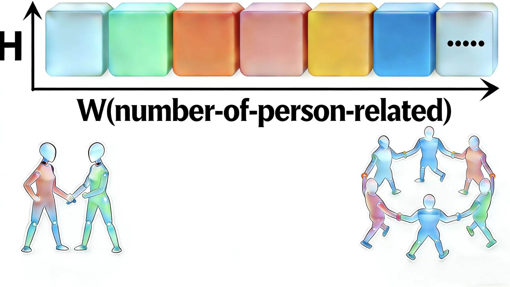

# LTX-MultiMotion: Number-free Person Motion Generation from Text

<div align="center">
  <a href="https://huggingface.co/Jonnty/LTX-MultiMotion"></a>
</div>

Built on LTX-Video-2B's lightweight architecture, LTX-MultiMotion re-engineers encoder and decoder to transform the spatial width dimension into a number-of-person-related representation. This enables dynamic motion generation for varying character counts without pre-defined constraints.

<div align="center">
  
</div>

## Key Innovations
- **Person-Aware Architecture**: We repurpose the spatial width dimension to dynamically represent varying numbers of characters in a unified latent space.
- **Specialized Pathways**: A triple-branch decoder with dedicated networks isolates and generates translation, orientation, and pose components in parallel.
- **Progressive Expansion**: The encoder and decoder network begins with a shallow structure and dynamically increases its depth layer-by-layer during training, adapting its capacity to the complexity of the motion data.

## Overview
This project is modified from [LTX-Video](https://github.com/Lightricks/LTX-Video).

## Setup & Preparation
### 1. Download Pretrained Models
- **LTX-Video First-Stage Model**: Download `ltxv-2b-0.9.8-distilled.safetensors` from [Lightricks/LTX-Video on Hugging Face](https://huggingface.co/Lightricks/LTX-Video/tree/main).
- **Text Encoder**: Use the same text encoder as LTX-Video: `PixArt-alpha/PixArt-XL-2-1024-MS` from [Hugging Face](https://huggingface.co/PixArt-alpha/PixArt-XL-2-1024-MS).

### 2. Prepare Training Data
- **Motion Data**: Place raw motion data (standardized as SMPL format, similar to AMASS) in `./motions/`. Data can be obtained from [InterGen](https://tr3e.github.io/intergen-page/).
- **Annotations**: Place per-person motion annotations in `./separate_annots/`. Data can be obtained from [FreeMotion](https://vankouf.github.io/FreeMotion/).

## Training the Decoder
### Stage 1: Prepare Latents for Decoder Injection
```bash
python latent_prepare.py
```

### Stage 2: Train Specialized Decoders
Train separate decoders for translation, orientation, and pose:
```bash
python decoder_train.py --features_dir [path_to_prepared_latents_from_stage1] --gt_dir ./motions --branch [trans/root/pose] --target_loss Loss --max_depth 20 --initial_depth 2 --patience 10 --min_improvement 0.001 --batch_size 1 --num_epochs 500 --learning_rate 1e-4 --num_workers 8 --save_freq 10 --save_dir [save_directory] --device cuda --min_epochs_after_depth_increase 30
```
## Pretrained Models
We provide pre-trained decoder models on Hugging Face at [Jonnty/LTX-MultiMotion](https://huggingface.co/Jonnty/LTX-MultiMotion/tree/main) for direct use. All models were trained for 500 epochs with progressive depth expansion:

- **Translation Decoder**: Loss improved from 0.19 to 0.015, current depth: 16 layers
- **Root (Orientation) Decoder**: Loss improved from 0.64 to 0.10, current depth: 13 layers  
- **Pose Decoder**: Loss improved from 0.037 to 0.018, current depth: 17 layers
## Inference
Generate motion from a text prompt:
```bash
python inference.py --prompt "Promote" --height 32 --width [32*number_of_person] --num_frames [number_of_frames] --pipeline_config configs/ltxv-2b-0.9.8-distilled.yaml --motion_mode --root_checkpoint_path [path_to_root_decoder_checkpoint] --trans_checkpoint_path [path_to_translation_decoder_checkpoint] --pose_checkpoint_path [path_to_pose_decoder_checkpoint]
```

